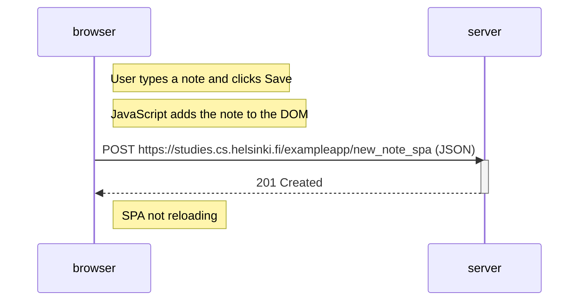

# Exercise 0.6: New note in SPA diagram

Sequence of events when the user creates a new note on
https://studies.cs.helsinki.fi/exampleapp/spa by typing into the text field
and clicking **Save**.

The page is not reloaded. JavaScript handles the form, updates the DOM, and
sends the note to the server as JSON.

